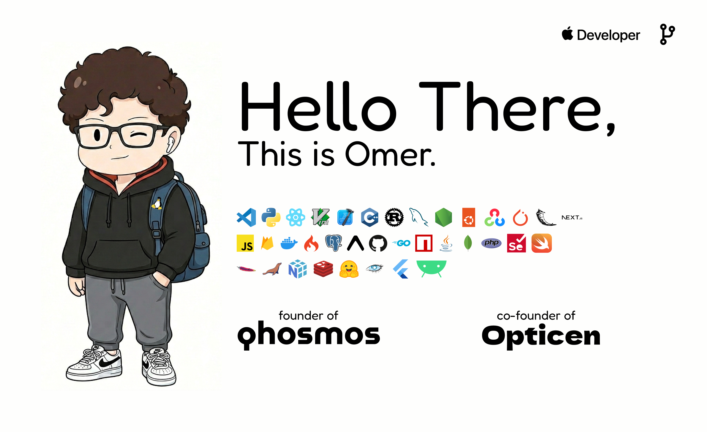

  

  

  

---

### What's Cooking?

I'm personally involved in both the `kitchen` and the `storefront` of the projects i build. 
From API design to interfaces, im hands on with every single line of code. whether its fetching data on the backend or styling a button on mobile, i handle it all. i enjoy it.

---

### Stats

  

  

---

### Ping Me.

Got a complex problem? Drop a message.

  
  

